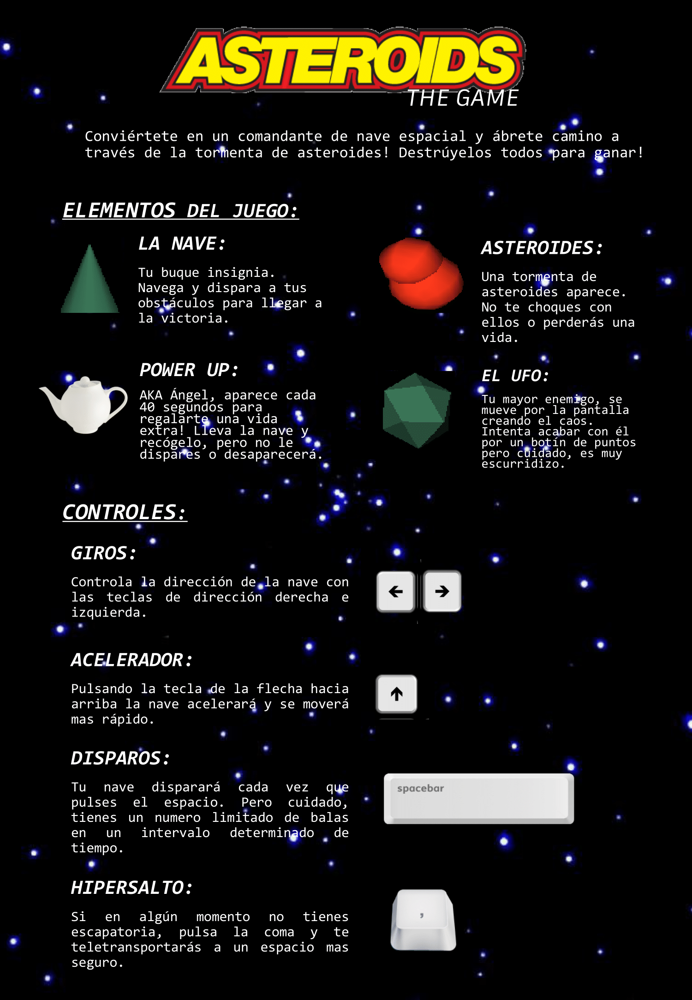

# Asteroids-with-openGL

## Description

The following repository includes an *object-oriented programming (OOP)* implementation of a version of the classic Atari arcade game **Asteroids**, in ANSI **C++**. 

The first version of it has been based on *Claudio Rossi* implementation (Technical University of Madrid, 2015). Our main contribution consists of: 
* Implementing the *Object List* class for the management of the game
* Creating the class Alien (from which the class TheUFO is instantiated)
* Integrating the UFO into the game logic
* Adjusting the scoring system
As extras, a new class called Angel has been added, which grants lives when captured (collided) by the ship. 

The graphics are made thanks to the **OpenGL** multiplatform library.

## Instructions 

## Acknowldegements
The awesome instructions have been designed by Celia Ramos Ramírez, her creativity and good initiative have guided us throughout the project.

Gonzalo Quiros Torres has been the main leader and has helped in every way necessary. The implementation of the erratic and random logic of the UFO has been all his own.

Finally, we would like to thank Claudio Rossi for teaching us object-oriented programming, especially in C++, and for launching us to carry out complex projects that challenge us to give more of ourselves.
